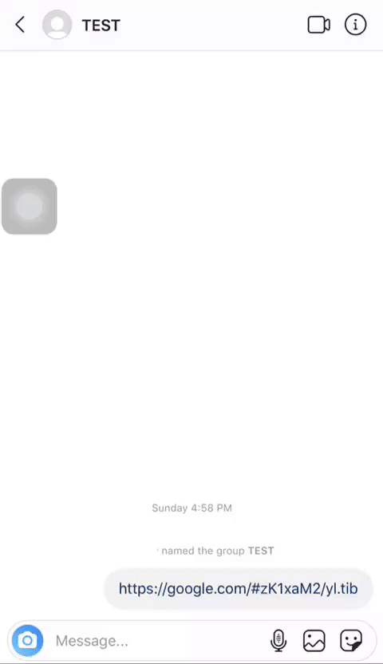

# RIUS - RTLO Injection URI Spoofing (0-day)

**CWE-451: User Interface (UI) Misrepresentation of Critical Information.**

> *The user interface (UI) does not properly represent critical information to the user, allowing the information to be spoofed. This is often a component in online scams, phishing and disinformation propagation.*

 &nbsp;

When a message contains a valid URL, it is highlighted and marked as hyperlink. However, this is printed to screen before sanitizing Unicode Control Characters, which results in URI spoofing via specially crafted messages.

` Affects all recent distributions of iOS iMessage, WhatsApp, Instagram, and Facebook Messenger as of 2019.8.15 `

---

WhatsApp iOS                    |        Instagram DM    |
:------------------------------:|:----------------------:|
           |  |
