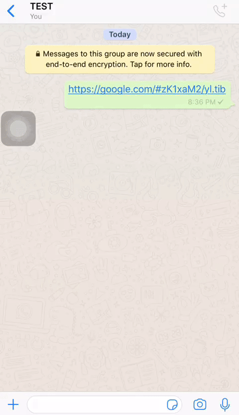

# RIUS - RTLO Injection URI Spoofing  CVE-2020-20093; 20094; 20095; 20096, 2022-28345

**CWE-451: User Interface Misrepresentation of Critical Information.**

**CWE-74:	Improper Neutralization of Special Elements in Output Used by a Downstream Component ('Injection')**

When a message contains a valid URL, it is highlighted and marked as hyperlink. However, this is printed to screen before sanitizing Unicode Control Characters, which results in URI spoofing via specially crafted messages.

 &nbsp;

Affects all recent distributions of iOS iMessage, WhatsApp, Instagram, and Facebook Messenger as of 2019.8.15 

Patched in Signal iOS 5.34 release: [commit](https://github.com/signalapp/Signal-iOS/commit/b0721e601e549996154127225c68769dfbfae506)

Patched in Telegram in 2019

---

WhatsApp                        |        Instagram DM    |
:------------------------------:|:----------------------:|
           |  |

---
**mapez** - [telegram](https://t.me/mapezz)
